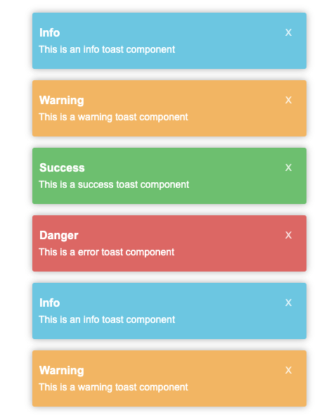

## Installation & Set Up

1. Install project dependencies
```bash
  yarn install or npm install
```

2. Start the development server
```bash
  yarn dev or npm run dev
```

3. Build for production

```bash
  yarn build or npm run build
```

5. Run production mode

```bash
  yarn start or npm start
```

## License

MIT © [Candra Kriswianrto](https://github.com/candraKriswinarto)

### Video Tutorial
You can see my youtube video for this project in [here](https://youtu.be/cOJTshh56Zc)
